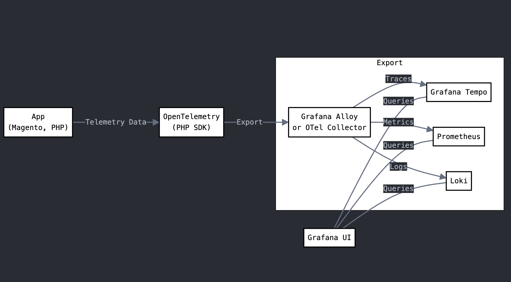
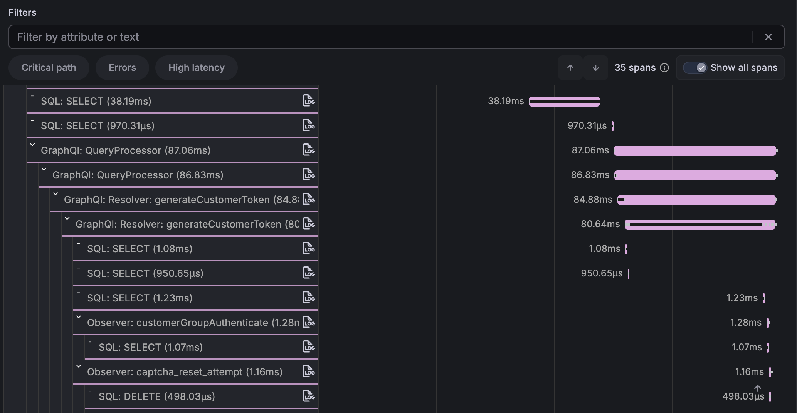

<div align="center">


# Magento 2 OpenTelemetry Instrumentation

OpenTelemetry integration package for Magento 2 applications with complete observability stack

[](https://packagist.org/packages/mumzworld/magento2-opentelemetry)
[](https://packagist.org/packages/mumzworld/magento2-opentelemetry/stats)


</div>

## 📖 Overview

A Composer library that adds [OpenTelemetry](https://opentelemetry.io/) tracing to Magento 2. It hooks into Magento core classes at runtime to automatically create spans for:

- **HTTP requests** — REST API, GraphQL, Backend admin, HTTP client
- **Database** — SQL query tracing
- **Cache** — Page cache, Redis, Varnish
- **CLI** — Commands, cron jobs, indexer operations
- **Entity** — EAV and flat entity load/save
- **Business logic** — Pricing, shipping, inventory, sales rules, repositories

## 🔄 OpenTelemetry Flow



## 📊 Grafana Traces



## ⚙️ How OpenTelemetry PHP SDK Works Under the Hood

```
1. PHP registers shutdown handler:
   OpenTelemetry\SDK\Common\Util\ShutdownHandler::register()

2. During shutdown:
   │
   └─> OpenTelemetry\SDK\Common\Util\ShutdownHandler::handleShutdown()
       │
       └─> Executes registered callbacks including:
           │
           └─> OpenTelemetry\SDK\Trace\TracerProvider->shutdown()
               │
               └─> Delegates to:
                   │
                   └─> OpenTelemetry\SDK\Trace\TracerSharedState->shutdown()
                       │
                       └─> Processes all span processors:
                           │
                           └─> OpenTelemetry\SDK\Trace\SpanProcessor\BatchSpanProcessor->shutdown()
                               │
                               └─> Final flush:
                                   │
                                   └─> OpenTelemetry\SDK\Trace\SpanProcessor\BatchSpanProcessor->flush()
                                       │
                                       └─> Delegates export to:
                                           │
                                           └─> OpenTelemetry\Contrib\Otlp\SpanExporter->export()
                                               │
                                               ├─> Serializes spans
                                               └─> Makes network call to collector
```

## 📋 Prerequisites

- PHP 8.0+
- PECL
- Composer
- OpenTelemetry PHP extension + PHP SDK
- Magento Application
  - Docker
  - Host

## 🔧 OpenTelemetry Setup

### 1. Install OpenTelemetry PHP Extension

```bash
pecl install opentelemetry
```

### 2. Configure the .ini Settings

Add the following to your PHP `.ini` file (e.g. `php.ini` or a custom `opentelemetry.ini`):

```ini
OTEL_PHP_AUTOLOAD_ENABLED="true"
OTEL_SERVICE_NAME=magento2
OTEL_TRACES_EXPORTER=otlp
OTEL_EXPORTER_OTLP_PROTOCOL=http/protobuf
OTEL_EXPORTER_OTLP_ENDPOINT=http://[COLLECTOR-IP]:4318
OTEL_PROPAGATORS=baggage,tracecontext
;OTEL_PHP_DISABLED_INSTRUMENTATIONS=magento2
;OTEL_PHP_EXCLUDED_URLS="health_check.php,get.php"
```

### 3. Verify the Extension

```bash
php -m | grep opentelemetry
php --ri opentelemetry
```

### 4. Install the PHP SDK

```bash
composer require open-telemetry/sdk open-telemetry/api open-telemetry/sem-conv open-telemetry/exporter-otlp
```

> **Note:** These packages are automatically installed as dependencies when you install `mumzworld/magento2-opentelemetry`. You only need to install them manually if you're setting up OpenTelemetry without this package.

## 📦 Package Installation

```bash
composer require mumzworld/magento2-opentelemetry
```

No Magento module setup is needed — the package bootstraps automatically via Composer's autoload mechanism.

## 🔍 What Is Auto-Instrumented

Once installed, this package automatically instruments the following Magento areas — no code changes required.

### Core

| Instrumentation | Hooked Class | Method |
|-----------------|-------------|--------|
| Magento Bootstrap | `Magento\Framework\App\Bootstrap` | `run()`, `terminate()` |
| Exception Handling | `Magento\Framework\App\Http` | `catchException()` |
| Profiler | `Magento\Framework\Profiler` | `start()`, `stop()` |
| Event Observers | `Magento\Framework\Event\InvokerInterface` | `dispatch()` |

### HTTP

| Instrumentation | Hooked Class | Method |
|-----------------|-------------|--------|
| REST API | `Magento\Webapi\Controller\Rest\Interceptor` | `dispatch()` |
| REST Exceptions | `Magento\Framework\Webapi\Exception` | `__construct()` |
| GraphQL Dispatch | `Magento\GraphQl\Controller\GraphQl\Interceptor` | `dispatch()` |
| GraphQL Query | `Magento\Framework\GraphQl\Query\QueryProcessor` | `process()` |
| GraphQL Resolver | `Magento\Framework\GraphQl\Query\ResolverInterface` | `resolve()` |
| Backend Admin | `Magento\Backend\App\AbstractAction` | `dispatch()` |
| HTTP Client | `GuzzleHttp\Client` | `send()` |

### Database

| Instrumentation | Hooked Class | Method |
|-----------------|-------------|--------|
| SQL Queries | `Magento\Framework\DB\Adapter\Pdo\Mysql` | `query()` |

### Cache

| Instrumentation | Hooked Class | Method |
|-----------------|-------------|--------|
| FormKey Flush | `Magento\PageCache\Observer\FlushFormKey\Interceptor` | `execute()` |
| Full Cache Flush | `Magento\CacheInvalidate\Observer\FlushAllCacheObserver` | `execute()` |
| Cache Invalidation | `Magento\PageCache\Observer\InvalidateCache` | `execute()` |
| Redis | `Magento\Framework\Cache\Backend\Redis` | `test()`, `save()`, `remove()`, `clean()` |
| Varnish Purge | `Magento\CacheInvalidate\Model\PurgeCache` | `sendPurgeRequest()` |

### CLI

| Instrumentation | Hooked Class | Method |
|-----------------|-------------|--------|
| CLI Runner | `Magento\Framework\Console\Cli` | `doRun()` |
| Console Commands | `Symfony\Component\Console\Command\Command` | `run()` |
| Cron Jobs | `Magento\Cron\Observer\ProcessCronQueueObserver` | `tryRunJob()` |
| Reindex | `Magento\Indexer\Model\Processor` | `reindexAllInvalid()` |
| Mview Actions | `Magento\Framework\Mview\View` | `executeAction()` |
| Mview Execute | `Magento\Framework\Mview\ActionInterface` | `execute()` |
| Mview Changelog | `Magento\Framework\Mview\View\ChangelogInterface` | `clear()` |

### Entity (EAV)

| Instrumentation | Hooked Class | Method |
|-----------------|-------------|--------|
| Product | `Magento\Catalog\Model\ResourceModel\Product\Interceptor` | `load()`, `save()`, `delete()` |
| Category | `Magento\Catalog\Model\ResourceModel\Category\Interceptor` | `load()`, `save()`, `delete()` |
| Customer | `Magento\Customer\Model\ResourceModel\Customer\Interceptor` | `load()`, `save()`, `delete()` |
| Customer Address | `Magento\Customer\Model\ResourceModel\Address\Interceptor` | `load()`, `save()`, `delete()` |

### Entity (Flat)

| Instrumentation | Hooked Class | Method |
|-----------------|-------------|--------|
| Quote | `Magento\Quote\Model\ResourceModel\Quote` | `load()`, `save()`, `delete()` |
| Quote Item | `Magento\Quote\Model\ResourceModel\Quote\Item` | `load()`, `save()`, `delete()` |
| Order | `Magento\Sales\Model\ResourceModel\Order` | `load()`, `save()`, `delete()` |
| Order Item | `Magento\Sales\Model\ResourceModel\Order\Item` | `load()`, `save()`, `delete()` |
| Invoice | `Magento\Sales\Model\ResourceModel\Order\Invoice` | `load()`, `save()`, `delete()` |
| Credit Memo | `Magento\Sales\Model\ResourceModel\Order\Creditmemo` | `load()`, `save()`, `delete()` |

### Business Logic (Misc)

| Instrumentation | Hooked Class | Method |
|-----------------|-------------|--------|
| Abstract DB | `Magento\Framework\Model\ResourceModel\Db\AbstractDb` | `load()`, `save()`, `delete()` |
| Product Repository | `Magento\Catalog\Model\ProductRepository` | `get()`, `getById()` |
| Category Repository | `Magento\Catalog\Model\CategoryRepository` | `get()` |
| Customer Repository | `Magento\Customer\Model\ResourceModel\CustomerRepository` | `get()`, `getById()` |
| Shipping Rates | `Magento\Shipping\Model\Shipping` | `collectRates()` |
| Final Price | `Magento\Catalog\Model\Product\Type\Price` | `getFinalPrice()`, `_applyTierPrice()` |
| Tax Calculation | `Magento\Tax\Model\Calculation` | `getRate()` |
| Sales Rules | `Magento\SalesRule\Model\Validator` | `process()` |
| Inventory | `Magento\CatalogInventory\Observer\QuantityValidatorObserver` | `execute()` |
| Totals Collector | `Magento\Quote\Model\Quote\TotalsCollector\Interceptor` | `collectAddressTotals()` |
| Address Totals | `Magento\Quote\Model\Quote\Address\Total\AbstractTotal` | `collect()` |
| Totals Collector | `Magento\Quote\Model\Quote\Address\Total\Collector` | `collect()` |
| Discount Calc | `Magento\SalesRule\Model\Rule\Action\Discount\AbstractDiscount` | `calculate()` |

## 🚀 Optimization Tips

### Install `ext-protobuf` PHP Extension

Preferred over the pure-PHP library `google/protobuf` for production:

```bash
pecl install protobuf
```

| Option | Package | Performance |
|--------|---------|-------------|
| **C extension (recommended)** | `ext-protobuf` via `pecl install protobuf` | Native speed, minimal overhead |
| Pure-PHP library | `google/protobuf` via Composer | Slower serialization, higher CPU usage |

> **NOTE:** To reduce the latency imposed by the OTel exporter:
> 1. Use a local OTel collector (instead of remote)
> 2. Use the `ext-protobuf` C extension instead of the Composer package

### Limiting the Number of Spans

See [OpenTelemetry SDK Environment Variables — Attribute Limits](https://opentelemetry.io/docs/specs/otel/configuration/sdk-environment-variables/#attribute-limits) for details on:

- Limiting the number of span attributes
- Limiting the length of span attribute values
- Limiting the number of events

### Export Settings

| Setting | Purpose | Default | Suggested | Effect of Tuning |
|---------|---------|---------|-----------|------------------|
| `OTEL_BSP_MAX_QUEUE_SIZE` | Max number of spans buffered in memory | 2048 | 10000+ | Prevents spans being dropped under high load |
| `OTEL_BSP_MAX_EXPORT_BATCH_SIZE` | Max spans exported per batch | 512 | 1000–5000 | Reduces export cycles, improves throughput |
| `OTEL_BSP_SCHEDULE_DELAY` | How often (ms) the processor checks the queue for exporting | 5000 ms | 100–200 ms | Faster flushing during long-running requests |
| `OTEL_BSP_EXPORT_TIMEOUT` | Max time (ms) allowed for a single export batch | 30000 ms | 1000–2000 ms | Prevents request shutdown from blocking if exporter is slow/hangs |

## ⚡ Performance Considerations

- **Sampling:** Use appropriate sampling rates for production (`0.1` = 10%)
- **Batching:** Configure batch processors in collector
- **Resource Limits:** Set memory and CPU limits
- **Network:** Use gRPC for better performance
- **Storage:** Configure appropriate retention policies

## 🤝 Contributing

1. Fork the repository
2. Create a feature branch
3. Make your changes
4. Add tests
5. Submit a pull request

## 📄 License

This package is licensed under the [MIT License](LICENSE).

## 💬 Support

For support and questions:

- Create an issue in the repository
- Check the troubleshooting section
- Review the [Magento 2 OpenTelemetry documentation](README.md)

---

Built with ❤️ by Mumzworld Development Team
